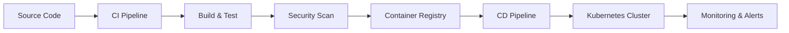

<div align="center">
  
  <!-- Animated Header with Typing Effect -->
  
  
  <br/>
  
  <!-- Animated Wave Banner -->
  
  
</div>

<!-- Profile Views Counter with Style -->
<div align="center">
  
  
  [](https://github.com/shivam2003-dev)
  [](https://www.linkedin.com/in/shivam-kumar2003/)
  
</div>

---


## 🚀 About Me

```yaml
name: Shivam Kumar
role: Site Reliability Engineer II
company: Kimbal Technologies
experience: 1.5+ Years
location: Delhi, India 🇮🇳
tenure: Jan 2024 - Present

expertise:
  - Site Reliability Engineering
  - Cloud-Native Architecture
  - GitOps & Kubernetes
  - Infrastructure Automation
  - Disaster Recovery & High Availability

mission: |
  Building secure, scalable, and automated infrastructure
  that powers mission-critical systems at scale.
```

### 💼 What I Do

🔹 **Infrastructure as Code (IaC)**: Developing Terraform modules for cloud provisioning, enhancing reusability and consistency  
🔹 **Container Orchestration**: Managing production Kubernetes clusters with Helm and ArgoCD for GitOps-driven deployments  
🔹 **CI/CD Excellence**: Building and maintaining automated pipelines for 10+ microservices using GitHub Actions  
🔹 **AWS Cloud Expertise**: Working with EKS, EC2, S3, VPC, WAF, Inspector, Lambda, EventBridge, SNS, and CloudWatch  
🔹 **Monitoring & Alerting**: Implementing multi-level alerting with Zabbix, integrated with Teams, PagerDuty, and email  
🔹 **Security & Compliance**: Deploying Wazuh for security monitoring, SonarQube for code quality, and Vault for secrets management  
🔹 **Automation at Scale**: Automated 50-100+ tasks ranging from system maintenance to cloud provisioning

<!-- Profile Views Counter with Style -->
<div align="center">
  
  
  [](https://github.com/shivam2003-dev)
  [](https://www.linkedin.com/in/shivam-kumar2003/)
  
</div>

---


## � About Me

```yaml
name: Shivam Kumar
role: DevOps Engineer
experience: 2+ Years
location: India 🇮🇳
current_focus: 
  - Cloud-Native Architecture
  - DevSecOps Implementation
  - Infrastructure Automation
  - CI/CD Pipeline Optimization

passion: |
  Transforming complex infrastructure challenges 
  into elegant, automated solutions that scale.
```

### 💼 What I Do

🔹 **Infrastructure as Code (IaC)**: Designing and managing cloud infrastructure with Terraform, CloudFormation, and Ansible  
🔹 **Container Orchestration**: Deploying and managing Kubernetes clusters for microservices architecture  
� **CI/CD Pipelines**: Building robust continuous integration and deployment workflows using Jenkins, GitHub Actions, and GitLab CI  
🔹 **Cloud Architecture**: Architecting scalable, secure, and cost-effective solutions on AWS, Azure, GCP, and OCI  
� **Monitoring & Observability**: Implementing comprehensive monitoring stacks with Prometheus, Grafana, and ELK  
🔹 **Security First**: Integrating security scanning, vulnerability management, and compliance automation  

---

## 🎯 Professional Highlights

<table>
<tr>
<td width="50%">

### 🏆 Key Achievements

- ✅ **Reduced deployment time by 70%** through automated CI/CD pipelines
- ✅ **Automated EMQX clustering** & OpenVPN setups for secure communications
- ✅ **Managed PostgreSQL clusters** with high availability and disaster recovery
- ✅ **Implemented APM solutions** enhancing system visibility by 85%
- ✅ **Zero-downtime deployments** using blue-green and canary strategies
- ✅ **Cost optimization** achieving 40% reduction in cloud spend

</td>
<td width="50%">

### 🎓 Learning & Growth

- � Contributing to **CNCF projects** 
- 🎯 Pursuing **Kubernetes certifications** (CKA/CKAD)
- � Studying **DevSecOps best practices**
- ☁️ Exploring **Multi-cloud strategies**
- 🤖 Experimenting with **GitOps workflows**
- 📊 Teaching **CS fundamentals** to aspiring engineers

</td>
</tr>
</table>

---

## 💻 Core Competencies

<details open>
<summary><b>🔧 DevOps & Automation</b></summary>
<br>



**Tools & Technologies:**
- **CI/CD**: Jenkins, GitHub Actions, GitLab CI/CD, CircleCI, ArgoCD
- **IaC**: Terraform, CloudFormation, Ansible, Pulumi
- **Containerization**: Docker, Kubernetes, Helm, Docker Compose
- **Version Control**: Git, GitHub, GitLab, Bitbucket

</details>

<details open>
<summary><b>☁️ Cloud Platforms</b></summary>
<br>

| Provider | Services | Experience |
|----------|----------|------------|
| **AWS** | EC2, ECS, EKS, Lambda, S3, RDS, CloudWatch, IAM | ⭐⭐⭐⭐⭐ |
| **Azure** | VMs, AKS, Azure DevOps, Storage, SQL Database | ⭐⭐⭐⭐ |
| **GCP** | Compute Engine, GKE, Cloud Functions, Cloud Storage | ⭐⭐⭐⭐ |
| **OCI** | Compute, Container Engine, Object Storage | ⭐⭐⭐ |

</details>

<details open>
<summary><b>📊 Monitoring & Observability</b></summary>
<br>

- **Metrics**: Prometheus, Grafana, CloudWatch, Azure Monitor
- **Logging**: ELK Stack (Elasticsearch, Logstash, Kibana), Fluentd, Loki
- **APM**: New Relic, Datadog, AppDynamics
- **Tracing**: Jaeger, Zipkin
- **Alerting**: PagerDuty, Opsgenie, Slack integrations

</details>

<details open>
<summary><b>� Security & Compliance</b></summary>
<br>

- **Security Scanning**: Trivy, Clair, Snyk, SonarQube
- **Secret Management**: HashiCorp Vault, AWS Secrets Manager
- **Access Control**: IAM, RBAC, OAuth 2.0, SSO
- **Compliance**: CIS Benchmarks, SOC 2, ISO 27001 practices
- **Network Security**: VPN (OpenVPN), Firewalls, Security Groups

</details>

---
## 🛠️ Technology Stack

<div align="center">

### **Programming & Scripting Languages**


### **Cloud Platforms**


### **Container & Orchestration**


### **Infrastructure as Code**


### **CI/CD & Version Control**


### **Monitoring & Observability**


### **Databases**


### **Security & Compliance**


### **Operating Systems**


### **Messaging & Communication**


</div>

---

## 📈 GitHub Analytics

<div align="center">
  
  <!-- GitHub Stats -->
  
  
  <!-- Top Languages -->
  
  
</div>

<div align="center">
  
  <!-- GitHub Streak Stats -->
  
  
</div>

<div align="center">
  
  <!-- Activity Graph -->
  
  
</div>

---

## 🏆 GitHub Trophies

<div align="center">
  
  
  
</div>

---

## 💡 Featured Projects & Contributions

<div align="center">

<!-- Add your pinned repos or featured projects here -->
[](https://github.com/shivam2003-dev/shivam2003-dev)

</div>

### 🚀 Project Highlights

- **🔧 Infrastructure Automation**: Terraform modules for multi-cloud deployment automation
- **🐳 Container Orchestration**: Custom Kubernetes operators and Helm charts for microservices
- **📊 Monitoring Stack**: Complete observability solution with Prometheus, Grafana, and Loki
- **🔐 Security Pipeline**: Automated security scanning and compliance checking in CI/CD
- **☁️ Cloud Migration**: Lift-and-shift and re-architecture projects for cloud optimization
- **🤖 ChatOps Integration**: Slack/Teams bots for infrastructure management

---

## 📚 Blog & Knowledge Sharing

<div align="center">

```ascii
╔═══════════════════════════════════════════════════════════════╗
║  "DevOps is not a goal, but a never-ending process of         ║
║   continual improvement." - Jez Humble                        ║
╚═══════════════════════════════════════════════════════════════╝
```

</div>

I regularly share insights on:
- 📝 Cloud architecture best practices
- 🔧 DevOps automation techniques
- 🐛 Troubleshooting and debugging stories
- 💡 Infrastructure optimization tips
- 🎯 Career guidance for aspiring DevOps engineers

---

## 🌐 Connect With Me

<div align="center">

[](https://www.linkedin.com/in/shivam-kumar2003/)
[](mailto:shivam.sk2003@gmail.com)
[](https://www.instagram.com/shivam__kumar_2003/)
[](https://github.com/shivam2003-dev)

</div>

---

## 🎯 Currently

```javascript
const shivam = {
    learning: ["Kubernetes Advanced Patterns", "GitOps with ArgoCD", "Service Mesh (Istio)"],
    contributing: ["CNCF Projects", "Open Source DevOps Tools"],
    exploring: ["AI/ML Ops", "FinOps", "Platform Engineering"],
    hobbies: ["Golf 🏌️‍♂️", "Traveling ✈️", "Teaching 📖", "Photography 📸"],
    motto: "Automate everything, monitor everything, secure everything!"
};
```

---

## 📬 Let's Collaborate!

<div align="center">

```yaml
open_for:
  - DevOps Consulting
  - Cloud Architecture Reviews
  - Technical Mentorship
  - Open Source Collaborations
  - Speaking Opportunities
  
reach_me_at: shivam.sk2003@gmail.com
response_time: < 24 hours ⚡
```

### 💼 Available for Freelance & Contract Work

🔹 Infrastructure Setup & Migration  
🔹 CI/CD Pipeline Implementation  
🔹 Cloud Cost Optimization  
🔹 DevOps Transformation Consulting  

</div>

---

<div align="center">
  
  ### ⚡ Fun Fact
  
  *I believe in "Infrastructure as Code, Everything as Code" - even my coffee preferences are version controlled! ☕*
  
  ---
  
  ### 📊 Profile Stats
  
  
  
  ---
  
  <!-- Footer Wave -->
  
  
  <sub>⭐️ From [shivam2003-dev](https://github.com/shivam2003-dev) with ❤️</sub>
  
</div>

<!---
shivam2003-dev/shivam2003-dev is a ✨ special ✨ repository because its `README.md` (this file) appears on your GitHub profile.
You can click the Preview link to take a look at your changes.
--->


