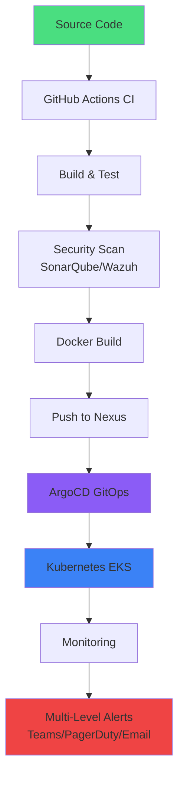

<div align="center">
  
  <!-- Animated Header with Typing Effect -->
  
  
  <br/>
  
  <!-- Animated Wave Banner -->
  
  
</div>

<!-- Profile Views Counter with Style -->
<div align="center">
  
  
  [](https://github.com/shivam2003-dev)
  [](https://www.linkedin.com/in/shivam-kumar2003/)
  
</div>

---


## 🚀 About Me

```yaml
name: Shivam Kumar
role: DevOps Engineer II
company: Kimbal Technologies
experience: 2+ Years
location: Delhi, India 🇮🇳
tenure: Jan 2024 - Present

expertise:
  - DevOps Engineer
  - Cloud-Native Architecture
  - GitOps & Kubernetes
  - Infrastructure Automation
  - Disaster Recovery & High Availability

mission: |
  Building secure, scalable, and automated infrastructure
  that powers mission-critical systems at scale.
```

### 💼 What I Do

🔹 **Infrastructure as Code (IaC)**: Developing Terraform modules for cloud provisioning, enhancing reusability and consistency  
🔹 **Container Orchestration**: Managing production Kubernetes clusters with Helm and ArgoCD for GitOps-driven deployments  
🔹 **CI/CD Excellence**: Building and maintaining automated pipelines for 10+ microservices using GitHub Actions  
🔹 **AWS Cloud Expertise**: Working with EKS, EC2, S3, VPC, WAF, Inspector, Lambda, EventBridge, SNS, and CloudWatch  
🔹 **Monitoring & Alerting**: Implementing multi-level alerting with Zabbix, integrated with Teams, PagerDuty, and email  
🔹 **Security & Compliance**: Deploying Wazuh for security monitoring, SonarQube for code quality, and Vault for secrets management  
🔹 **Automation at Scale**: Automated 50-100+ tasks ranging from system maintenance to cloud provisioning

---

## 🎯 Professional Highlights

<div align="center">
  
  ### 🏢 Kimbal Technologies | DevOps Engineer
  **Jun 2024 - Present (1 yr 10 mos) | Delhi, India**
  
</div>

<table>
<tr>
<td width="50%">

### 🏆 Key Achievements

- ✅ **Automated 50-100+ tasks** from system maintenance to cloud provisioning
- ✅ **Built CI/CD pipelines** for 10+ microservices using GitHub Actions
- ✅ **Reduced deployment time by 60%** through GitOps with ArgoCD
- ✅ **Managed 30+ successful DR drills** for utility and discom clients
- ✅ **Deployed Wazuh** for security monitoring across 10+ environments
- ✅ **Implemented real-time alerting** with AWS SNS, CloudWatch, and multi-level Zabbix integration
- ✅ **Set up production EMQX cluster** with 3-node auto-discovery architecture
- ✅ **Automated PostgreSQL backups** using pgBackRest with Ansible to S3

</td>
<td width="50%">

### 🚀 Current Responsibilities

**DevOps Engineer II (Jun 2025 - Present)**
- 🔔 Integrated AWS SNS with internal services for real-time alerts
- 📊 Multi-level alerting in Zabbix (Email, Teams, PagerDuty)
- 🤖 AWS Lambda automation via EventBridge
- 💾 Automated PostgreSQL backups to S3 with Ansible

**DevOps Engineer (Jun 2024 - Jun 2025)**
- ☸️ Kubernetes, Docker, Helm, ArgoCD deployments
- 🏗️ Terraform module development for IaC
- 🔐 HashiCorp Vault administration
- 📦 Nexus Repository management
- 🛡️ Wazuh & SonarQube deployment
- 🗄️ Database management (PostgreSQL, MSSQL, Cassandra, Neo4j)
- 🌐 DNS & hybrid infrastructure management

</td>
</tr>
</table>

---

## 💡 Technical Expertise & Impact

<div align="center">



</div>

### 🎯 Real-World Impact

<table>
<tr>
<td align="center" width="33%">

**🔄 Automation**
<br><br>
Automated **50-100+ tasks**
<br>
Reduced manual work by **70%**
<br>
Lambda functions for event-driven automation

</td>
<td align="center" width="33%">

**☸️ Kubernetes & GitOps**
<br><br>
**10+ microservices** deployed
<br>
ArgoCD for continuous delivery
<br>
Production-grade EKS clusters

</td>
<td align="center" width="33%">

**🛡️ Reliability & DR**
<br><br>
**30+ successful DR drills**
<br>
99.9% uptime maintenance
<br>
Multi-environment security monitoring

</td>
</tr>
</table>

---

## 💻 Core Competencies

<details open>
<summary><b>🔧 SRE & Automation</b></summary>
<br>

**Infrastructure Automation:**
- **CI/CD**: GitHub Actions (10+ microservices pipelines), ArgoCD, CodePipeline
- **IaC**: Terraform (custom modules), Ansible (configuration management)
- **Scripting**: Bash, PowerShell for 50-100+ automation tasks
- **GitOps**: ArgoCD for declarative Kubernetes deployments

**Key Technologies:**
- AWS Lambda + EventBridge for event-driven automation
- Ansible playbooks for EMQX, OpenVPN, PostgreSQL configuration
- Terraform for cloud resource provisioning and management

</details>

<details open>
<summary><b>☁️ Cloud & Infrastructure</b></summary>
<br>

| Area | Technologies | Expertise |
|------|-------------|-----------|
| **AWS Services** | EKS, EC2, S3, VPC, WAF, Inspector, Lambda, EventBridge, SNS, CloudWatch | ⭐⭐⭐⭐⭐ |
| **Container Orchestration** | Kubernetes, Docker, Helm, ArgoCD | ⭐⭐⭐⭐⭐ |
| **Networking** | VPC, DNS Management, Hybrid Infrastructure, OpenVPN | ⭐⭐⭐⭐ |
| **Disaster Recovery** | 30+ DC-DR & DR-DC drills, Backup strategies | ⭐⭐⭐⭐⭐ |

</details>

<details open>
<summary><b>📊 Monitoring & Observability</b></summary>
<br>

- **Monitoring**: Zabbix (integrated with internal systems for real-time visibility)
- **Alerting**: Multi-level alerts via Email, Microsoft Teams, and PagerDuty
- **Cloud Monitoring**: AWS CloudWatch with full logging and metrics tracking
- **Security Monitoring**: Wazuh deployed across 10+ environments
- **Code Quality**: SonarQube for automated code quality analysis

</details>

<details open>
<summary><b>🔐 Security & Secrets Management</b></summary>
<br>

- **Secrets Management**: HashiCorp Vault for secure credential handling
- **Security Monitoring**: Wazuh for threat detection and compliance
- **Code Security**: SonarQube for vulnerability scanning
- **AWS Security**: WAF, Inspector, Security Groups configuration
- **Network Security**: OpenVPN setup and management

</details>

<details open>
<summary><b>🗄️ Database & Storage</b></summary>
<br>

- **Relational**: PostgreSQL (production clusters with pgBackRest backups), MSSQL
- **NoSQL**: Cassandra, Neo4j
- **Backup Strategy**: Automated PostgreSQL backups to S3 using pgBackRest with Ansible
- **Performance**: Database optimization, high availability configurations

</details>

<details open>
<summary><b>📦 Artifact & Repository Management</b></summary>
<br>

- **Nexus Repository**: Managing and distributing build artifacts and Docker images
- **Container Registries**: Docker image lifecycle management
- **Version Control**: Git, GitHub for source code and GitOps workflows
- **EMQX Messaging**: 3-node production cluster with auto-discovery and MQTT

</details>

---

## 🛠️ Technology Stack

<div align="center">

### **Programming & Scripting Languages**


### **Cloud Platforms**


### **Container & Orchestration**


### **Infrastructure as Code**


### **CI/CD & Version Control**


### **Monitoring & Observability**


### **Databases**


### **Security & Compliance**


### **Operating Systems**


### **Messaging & Artifact Management**


</div>

---

## 📈 GitHub Analytics

### 📊 Contribution Activity


### ⚡ Profile Metrics


<table>
<tr>
<td width="50%">


</td>
<td width="50%">


</td>
</tr>
<tr>
<td width="50%">


</td>
<td width="50%">


</td>
</tr>
</table>

</div>

---

## 🏆 GitHub Trophies

<div align="center">
  
  
  
</div>

---

## 💡 Featured Projects & Contributions

<div align="center">

<!-- Featured GitHub Repositories -->
<a href="https://github.com/shivam2003-dev/devops_homelab">
  
</a>

<a href="https://github.com/highlevel-performance/dotfile">
  
</a>


<a href="https://github.com/shivam2003-dev/whatsapp_summary_bot">
  
</a>

<a href="https://github.com/shivam2003-dev/flamegraph">
  
</a>

</div>

### 🚀 Project Highlights

#### 🏠 [DevOps HomeLab](https://github.com/shivam2003-dev/devops_homelab)
Complete home lab infrastructure setup for learning and experimenting with DevOps tools and practices. Features containerization, orchestration, and monitoring solutions.

#### 💬 [WhatsApp Summary Bot](https://github.com/shivam2003-dev/whatsapp_summary_bot)
Intelligent bot that automatically summarizes WhatsApp conversations using AI/ML techniques. Built with automation and natural language processing capabilities.

#### 🔥 [Flamegraph](https://github.com/shivam2003-dev/flamegraph)
Performance profiling and visualization tool for analyzing system bottlenecks and optimizing application performance. Essential for SRE troubleshooting.

### � Work Projects & Achievements

- **🔧 Infrastructure Automation**: Terraform modules for AWS infrastructure provisioning and management
- **🐳 GitOps with ArgoCD**: Declarative Kubernetes deployments for 10+ microservices
- **📊 Multi-Level Monitoring**: Zabbix integration with PagerDuty, Teams, and email alerting
- **🔐 Security Pipeline**: Wazuh deployment across 10+ environments with SonarQube integration
- **☁️ Cloud Migration**: Successfully executed 30+ disaster recovery drills for utility clients
- **🤖 Event-Driven Automation**: AWS Lambda functions triggered by EventBridge for operational tasks
- **💾 Database Automation**: pgBackRest-based PostgreSQL backup automation to S3
- **📡 EMQX Cluster**: Production-ready 3-node MQTT messaging cluster with auto-discovery

---

## 📚 Skills & Interests

<div align="center">

```ascii
╔═══════════════════════════════════════════════════════════════╗
║  "DevOps Engineering is about building systems      ║
║   that are reliable, scalable, and maintainable."             ║
╚═══════════════════════════════════════════════════════════════╝
```

</div>

💡 **Passionate About:**
- 🚀 Building secure, scalable, and automated infrastructure
- 📖 Open source contributions and continuous learning
- 🧠 Solving infrastructure challenges at scale
- 🔄 GitOps practices and cloud-native deployments
- 🎯 Disaster recovery planning and execution
- 📊 Teaching CS fundamentals to aspiring engineers

---

## 🌐 Connect With Me

<div align="center">

[](https://www.linkedin.com/in/shivam-kumar2003/)
[](mailto:shivam.sk2003@gmail.com)
[](https://www.instagram.com/shivam__kumar_2003/)
[](https://github.com/shivam2003-dev)

</div>

---

## 🎯 Currently

```javascript
const shivam = {
    role: "DevOps Engineer II @ Kimbal Technologies",
    learning: ["Advanced Kubernetes Patterns", "GitOps Best Practices", "AWS Solutions Architecture"],
    working_on: [
        "AWS Lambda automation with EventBridge",
        "Multi-level alerting systems",
        "PostgreSQL backup automation",
        "Infrastructure optimization"
    ],
    exploring: ["FinOps", "Platform Engineering", "Service Mesh"],
    hobbies: ["Golf 🏌️‍♂️", "Traveling ✈️", "Teaching 📖"],
    motto: "Automate everything, monitor everything, secure everything!",
    fun_fact: "Successfully conducted 30+ DR drills without breaking a sweat! 💪"
};
```

---

## 📬 Let's Collaborate!

<div align="center">

```yaml
open_for:
  - SRE Consulting
  - Cloud Infrastructure Reviews
  - Technical Mentorship
  - Open Source Collaborations
  - Speaking Opportunities
  
specialties:
  - Kubernetes & GitOps Implementation
  - AWS Infrastructure Automation
  - Disaster Recovery Planning
  - CI/CD Pipeline Design
  - Security & Compliance
  
reach_me_at: shivam.sk2003@gmail.com
response_time: < 24 hours ⚡
```

### 💼 Available for Freelance & Contract Work

🔹 Infrastructure Setup & Migration  
🔹 Kubernetes & ArgoCD Implementation  
🔹 CI/CD Pipeline Design & Optimization  
🔹 Cloud Cost Optimization & FinOps  
🔹 Disaster Recovery Strategy & Execution  

</div>

---

<div align="center">
  
  ### ⚡ Fun Fact
  
  *I've automated so many tasks that my colleagues think I have a twin! 🤖*  
  *Infrastructure as Code? More like Infrastructure as Coffee! ☕*
  
  ---
  
  ### 📊 Profile Stats
  
  
  
  ---
  
  <!-- Footer Wave -->
  
  
  <sub>⭐️ From [shivam2003-dev](https://github.com/shivam2003-dev) with ❤️ | Powered by ☕ and 🤖</sub>
  
</div>

<!---
shivam2003-dev/shivam2003-dev is a ✨ special ✨ repository because its `README.md` (this file) appears on your GitHub profile.
You can click the Preview link to take a look at your changes.
--->
