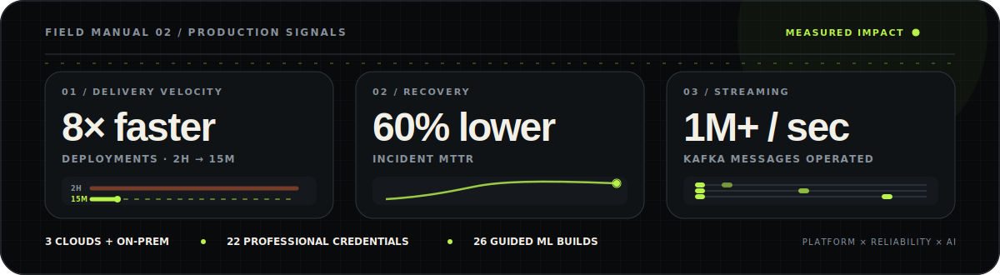
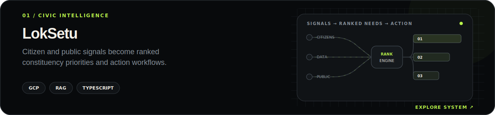
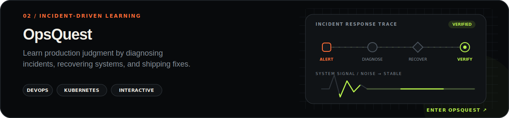
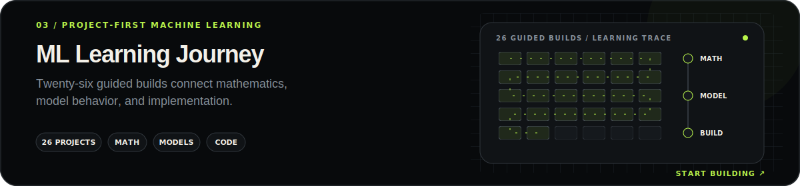
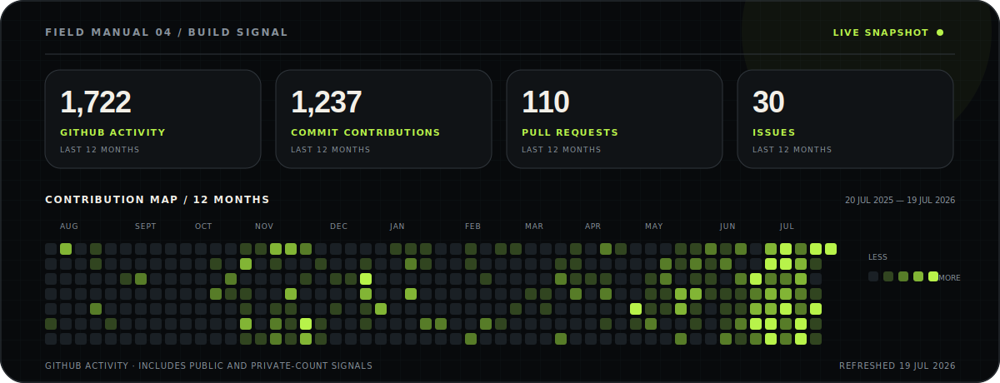
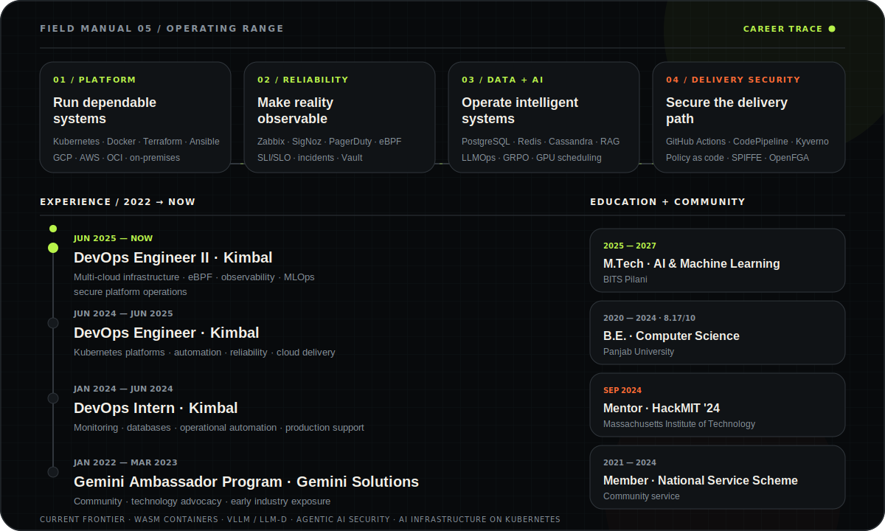
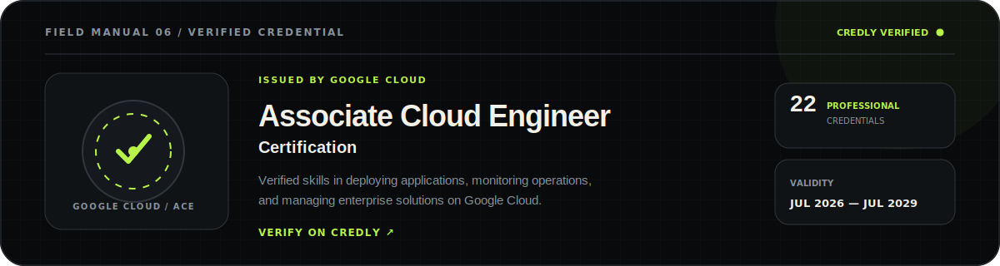
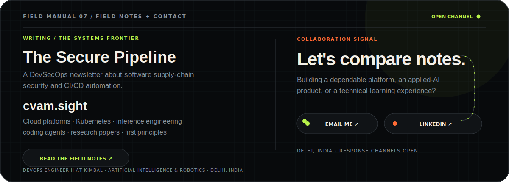

  <a href="https://about.shivam2003.com/">
    <picture>
      <source media="(max-width: 600px)" srcset="./assets/hero-mobile.svg" />
      
    </picture>
  </a>

  <a href="https://about.shivam2003.com/"><b>Portfolio ↗</b></a>
  &nbsp;&nbsp;·&nbsp;&nbsp;
  <a href="https://shivam2003.com/"><b>Field notes ↗</b></a>
  &nbsp;&nbsp;·&nbsp;&nbsp;
  <a href="https://www.linkedin.com/in/shivam-kumar2003/"><b>LinkedIn ↗</b></a>
  &nbsp;&nbsp;·&nbsp;&nbsp;
  <a href="mailto:shivam.sk2003@gmail.com"><b>Email ↗</b></a>

  <samp>DEVOPS ENGINEER II @ KIMBAL · AI &amp; ROBOTICS · M.TECH AI &amp; ML @ BITS PILANI</samp>

 

<picture>
  <source media="(max-width: 600px)" srcset="./assets/proof-mobile.svg" />
  
</picture>

 

## Selected work

<a href="https://github.com/shivam2003-dev/LokSetu">
  <picture>
    <source media="(max-width: 600px)" srcset="./assets/project-loksetu-mobile.svg" />
    
  </picture>
</a>

<a href="https://prepare.shivam2003.com/">
  <picture>
    <source media="(max-width: 600px)" srcset="./assets/project-opsquest-mobile.svg" />
    
  </picture>
</a>

<a href="https://ml.shivam2003.com/">
  <picture>
    <source media="(max-width: 600px)" srcset="./assets/project-ml-journey-mobile.svg" />
    
  </picture>
</a>

  <a href="https://github.com/shivam2003-dev/LokSetu"><b>Explore LokSetu ↗</b></a>
  &nbsp;&nbsp;·&nbsp;&nbsp;
  <a href="https://prepare.shivam2003.com/"><b>Enter OpsQuest ↗</b></a>
  &nbsp;&nbsp;·&nbsp;&nbsp;
  <a href="https://ml.shivam2003.com/"><b>Start ML Journey ↗</b></a>

 

## Build signal

<picture>
  <source media="(max-width: 600px)" srcset="./assets/activity-mobile.svg" />
  
</picture>

  SELF-OWNED TELEMETRY · GENERATED FROM GITHUB DATA · REFRESHED WEEKLY

 

<picture>
  <source media="(max-width: 600px)" srcset="./assets/career-mobile.svg" />
  
</picture>

 

<a href="https://www.credly.com/badges/08cdd1c7-db2c-4661-99ab-f4d3bda04bc2">
  <picture>
    <source media="(max-width: 600px)" srcset="./assets/credential-mobile.svg" />
    
  </picture>
</a>

  <a href="https://www.credly.com/badges/08cdd1c7-db2c-4661-99ab-f4d3bda04bc2"><b>Verify on Credly ↗</b></a>
  &nbsp;&nbsp;·&nbsp;&nbsp;
  <a href="https://about.shivam2003.com/"><b>View professional profile ↗</b></a>

  
<b>View the complete credential archive · 22 certifications</b>

   

### Cloud computing & infrastructure

- **Associate Cloud Engineer Certification** — Google Cloud · Jul 2026–Jul 2029
- **GCP Cloud Engineer** — O'Reilly · Jul 2026
- **KubeCon + CloudNativeCon India 2026** — The Linux Foundation · Jun 2026
- **KubeCon + CloudNativeCon India 2025** — CNCF · Aug 2025
- **AWS Cost Optimization** — Educative · Apr 2026
- **A Practical Guide to Helm** — Educative · Aug 2025
- **GitHub Actions** — KodeKloud · Apr 2024
- **Terraform Basics Training Course** — KodeKloud · Apr 2024

### Artificial intelligence & machine learning

- **Claude Code in Action** — Anthropic · Mar 2026
- **LLMOps: Building Production-Ready LLM Systems** — Educative · Mar 2026
- **Fundamentals of Machine Learning for Software Engineers** — Educative · Jun 2025

### Software engineering, databases & architecture

- **System Design Interview: Fast-Track in 48 Hours** — Educative · Aug 2025
- **Complete Guide to Redis** — Educative · Jun 2025
- **Mastering PostgreSQL Databases: From Basics to Advanced** — Educative · Jun 2025
- **Introduction to Apache Cassandra** — Educative · Jun 2025

### Cybersecurity

- **Certified Cloud Security Practitioner – AWS (CCSP-AWS)** — The SecOps Group · Aug 2023
- **Linux Privilege Escalation for Beginners** — TCM Security · Jul 2023
- **Windows Privilege Escalation for Beginners** — TCM Security · Jul 2023
- **Practical Malware Analysis & Triage** — TCM Security · Jul 2023
- **Completed Beginner** — TryHackMe · Jan 2022
- **Pre Security** — TryHackMe · Dec 2021
- **Advent of Cyber 3** — TryHackMe · Dec 2021

 

<picture>
  <source media="(max-width: 600px)" srcset="./assets/notes-contact-mobile.svg" />
  
</picture>

  <a href="https://shivam2003.com/"><b>Read the field notes ↗</b></a>
  &nbsp;&nbsp;·&nbsp;&nbsp;
  <a href="https://www.linkedin.com/in/shivam-kumar2003/"><b>Follow The Secure Pipeline ↗</b></a>
  &nbsp;&nbsp;·&nbsp;&nbsp;
  <a href="mailto:shivam.sk2003@gmail.com"><b>Email me ↗</b></a>
  &nbsp;&nbsp;·&nbsp;&nbsp;
  <a href="https://www.linkedin.com/in/shivam-kumar2003/"><b>Connect on LinkedIn ↗</b></a>

