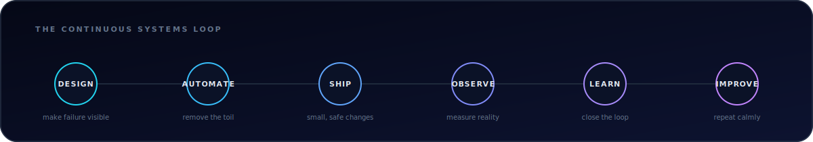

  

  
  
  
  

 

## I make complex systems feel calm.

I'm a **DevOps Engineer at Kimbal Technologies** in Delhi, working where cloud infrastructure, Kubernetes, delivery automation, observability, security, and data platforms meet. Alongside production engineering, I'm pursuing an **M.Tech in Artificial Intelligence & Machine Learning at BITS Pilani** and applying an operator's mindset to AI systems: reproducibility, evaluation, inference, cost, and reliability.

> My rule of thumb: automate the repetition, expose the failure mode, and leave the system easier to understand than I found it.

<table>
  <tr>
    <td width="25%" align="center"><b>2h → 15m</b> deployment time</td>
    <td width="25%" align="center"><b>60% ↓</b> incident MTTR</td>
    <td width="25%" align="center"><b>1M+ / sec</b> Kafka messages operated</td>
    <td width="25%" align="center"><b>2+ years</b> production systems</td>
  </tr>
</table>

 

## What I'm building now

<table>
  <tr>
    <td width="50%" valign="top">
      <h3><a href="https://github.com/shivam2003-dev/LokSetu">LokSetu ↗</a></h3>
      
<b>Digital public infrastructure for civic decision-making.</b>

      
Turns citizen input, official datasets, and public signals into ranked constituency needs and role-scoped MP workflows.

      
<code>TypeScript</code> <code>GCP</code> <code>RAG</code> <code>Public infrastructure</code>

    </td>
    <td width="50%" valign="top">
      <h3><a href="https://prepare.shivam2003.com/">OpsQuest ↗</a></h3>
      
<b>DevOps learning through production incidents.</b>

      
A practical, gamified environment for building operational judgment—not memorizing disconnected commands.

      
<code>TypeScript</code> <code>DevOps</code> <code>Interactive learning</code>

    </td>
  </tr>
  <tr>
    <td width="50%" valign="top">
      <h3><a href="https://ml.shivam2003.com/">ML Learning Journey ↗</a></h3>
      
<b>A project-first path through machine learning.</b>

      
Twenty-six guided builds that connect mathematical foundations, model behavior, and real implementation.

      
<code>Machine learning</code> <code>Projects</code> <code>Education</code>

    </td>
    <td width="50%" valign="top">
      <h3><a href="https://shivam2003.com/">cvam.sight ↗</a></h3>
      
<b>Field notes from the systems frontier.</b>

      
Long-form explanations of cloud, DevOps, LLM architecture, inference engineering, coding agents, and research papers.

      
<code>Systems</code> <code>AI infrastructure</code> <code>Technical writing</code>

    </td>
  </tr>
</table>

<a href="https://github.com/shivam2003-dev?tab=repositories"><b>Explore all projects →</b></a>

 

## How I think about systems

  

 

## The operating stack

  
<b>Platform, cloud & delivery</b>

   
  

    
  

  
<code>Helm</code> · <code>Argo CD</code> · <code>OKE / EKS</code> · <code>Nginx Ingress</code> · <code>Vault</code> · <code>OCI</code>

  
<b>Reliability, security & data</b>

   
  

    
  

  
<code>PagerDuty</code> · <code>Zabbix</code> · <code>ELK</code> · <code>CloudWatch</code> · <code>Cassandra</code> · <code>Wazuh</code> · <code>SonarQube</code>

  
<b>AI, software & emerging systems</b>

   
  

    
  

  
<code>LLM inference</code> · <code>RAG / CRAG</code> · <code>Agents</code> · <code>Evaluation</code> · <code>Computer vision</code> · <code>Reinforcement learning</code>

 

## From production to first principles

| In production | In the learning loop |
| --- | --- |
| Kubernetes platforms, GitOps, Terraform, Ansible | LLM architecture, inference serving, evaluation |
| SLI/SLO observability, incident response, runbooks | Deep learning, computer vision, reinforcement learning |
| Kafka, PostgreSQL, Cassandra, Redis | Mathematics, optimization, reproducible experiments |
| DevSecOps, cloud networking, migrations | Robotics and quantum computing foundations |

I write what I learn at **[cvam.sight](https://shivam2003.com/)**—including source-level coding-agent walkthroughs, practical toolboxes, architecture deep dives, and research distilled into plain language.

 

## Current signal

  

 

  <h2>Let's build something that survives contact with production.</h2>
  
Open source · Platform engineering · AI infrastructure · Technical collaboration

  

    <a href="mailto:shivam.sk2003@gmail.com"><b>Start a conversation ↗</b></a>
    &nbsp;·&nbsp;
    <a href="https://about.shivam2003.com/"><b>See the full story ↗</b></a>
  

   
  Delhi, India · Automate early. Observe deeply. Keep systems calm.

